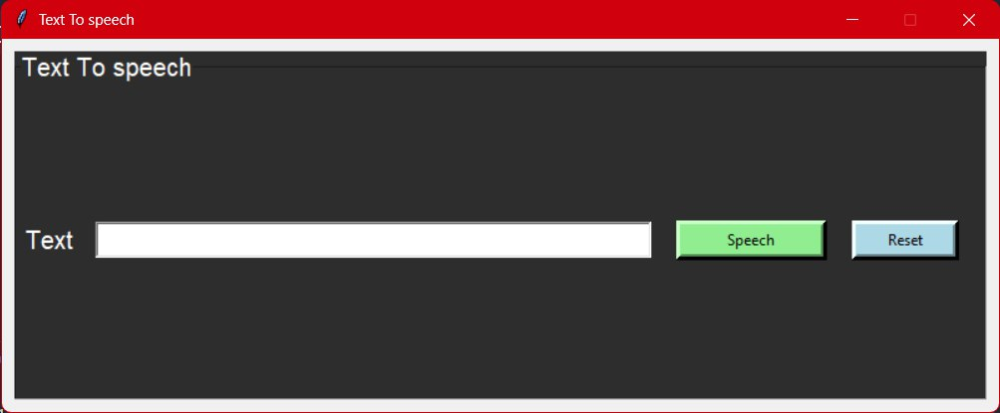

# Text-To-Speech

<h2>pyttsx3</h2>

It is a text-to-speech conversion library in Python. 
Unlike alternative libraries, it works offline and is compatible with both Python 2 and 3.
An application invokes the pyttsx3.init() factory function to get a reference to a pyttsx3.
Engine instance it is a very easy to use tool which converts the entered text into speech.
The pyttsx3 module supports two voices first is female and the second is male which is provided by “sapi5” for windows

